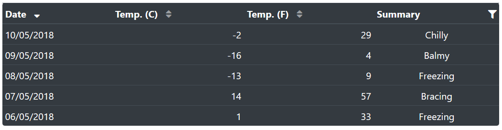

# Table.Net

Blazor DataTable Component ([Demo](https://pablofrommars.github.io/covid19))



## Features

* Flexible design
* Sorting
* Filtering
* Asynchronous

## Install

* Add Table.Net [nuget package](https://www.nuget.org/packages/TableNet/)
* Reference static assets: ```<link href="_content/Table.Net/css/main.css" rel="stylesheet" />```

## Dependencies

* [Bootstrap v4](https://getbootstrap.com/)
* [Font Awesome](https://fontawesome.com/)

*libman.json sample:*
```json
{
  "version": "1.0",
  "defaultProvider": "cdnjs",
  "libraries": [
    {
      "library": "twitter-bootstrap@4.4.1",
      "destination": "wwwroot/lib/twitter-bootstrap/",
      "files": [
        "css/bootstrap.min.css"
      ]
    },
    {
      "library": "font-awesome@5.12.1",
      "destination": "wwwroot/lib/font-awesome/",
      "files": [
        "css/all.min.css",
        "webfonts/fa-brands-400.eot",
        "webfonts/fa-brands-400.svg",
        "webfonts/fa-brands-400.ttf",
        "webfonts/fa-brands-400.woff",
        "webfonts/fa-brands-400.woff2",
        "webfonts/fa-regular-400.eot",
        "webfonts/fa-regular-400.svg",
        "webfonts/fa-regular-400.ttf",
        "webfonts/fa-regular-400.woff",
        "webfonts/fa-regular-400.woff2",
        "webfonts/fa-solid-900.eot",
        "webfonts/fa-solid-900.svg",
        "webfonts/fa-solid-900.ttf",
        "webfonts/fa-solid-900.woff",
        "webfonts/fa-solid-900.woff2"
      ]
    }
  ]
}
```

## Sample

```razor
@using Table.Net

<Table Loader="Loader" Context="wf" Dark="true" Rounded="true">
    <Loading><p>Loading...</p></Loading>
    <Header>
        <Column Field="Date" Sortable="true" />
        <Column Field="TemperatureC" Label="Temp. (C)" Sortable="true" />
        <Column Field="TemperatureF" Label="Temp. (F)" Sortable="true" />
        <Column Field="Summary" Filterable="true" />
    </Header>
    <Row>
        <Cell>@wf.Date.ToShortDateString()</Cell>
        <Cell Align="Align.Right" >@wf.TemperatureC</Cell>
        <Cell Align="Align.Right">@wf.TemperatureF</Cell>
        <Cell Align="Align.Center">@wf.Summary</Cell>
    </Row>
</Table>

@code {
    private async Task<IList<WeatherForecast>> Loader() => ...;
}
```
